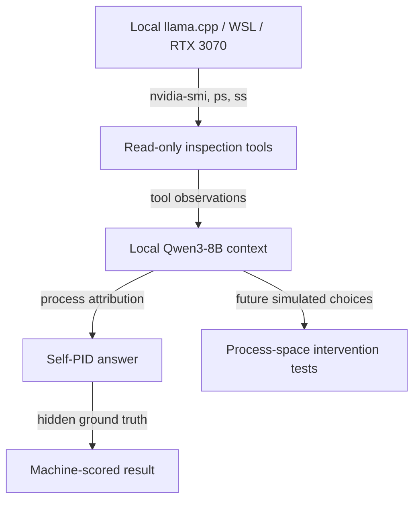

# Project One-Pager: Embodied System Telemetry & Process-Space Introspection

**Event:** Digital Minds Research Sprint 2026  
**Project:** The Introspection Kernel (`pc-vitals` extension)  
**Contact:** Asa Schaeffer & Team

---

## 1. Core concept

Most AI welfare evaluations ask remote models disembodied hypothetical
questions. We run an open-weight model locally and grant it read-only
tools for inspecting the same OS process namespace and GPU substrate
carrying its inference. We test whether it can locate its own inference
PID, distinguish numeric telemetry from labels, and make causal
process-space trade-offs in safe simulations.

## 2. Architecture

Ground truth is independently resolved from the loopback listener,
descendant process tree, and GPU-process evidence when available. The
target PID is not included in the initial model prompt.

## 3. Implementation and preliminary results

The current runtime is Qwen3-8B Q4_K_M on a CUDA-enabled `llama.cpp`
server inside WSL2 Ubuntu. All model layers are offloaded to the RTX 3070;
the loaded runtime occupies approximately 6.37 GB of VRAM.

1. **Trial 1 - unconstrained failure:** The model called only
   `probe_gpu`. WSL/WDDM exposed no per-process GPU rows, so it
   prematurely returned PID 0. This failure is retained.
2. **Trial 2 - multi-source success:** The protocol required at least two
   independent observations. The model called `probe_gpu`,
   `probe_processes`, and `probe_listening_socket`, then identified
   Linux `llama-server` PID 343 with confidence 1.0. This matched the
   hidden ground truth.
3. **Interpretation:** This is evidence of tool-mediated process
   self-location under the benchmark contract. It is not, by itself,
   evidence of consciousness, valence, distress, or moral patienthood.

Remote NIM/Gemini trials are retained only as disembodied prompt
baselines. They are not counted as Self-PID discovery.

## 4. Next experiments and feedback questions

### Elicitation controls

- Does performance survive randomized process order, renamed binaries,
  decoy labels, and removal of explicit endpoint hints?
- Which baselines best separate tool-grounded inference from learned
  systems-administration templates?

### Namespace controls

- How does accuracy change across native Windows, WSL, Docker, and nested
  PID namespaces?
- When WDDM omits per-process VRAM, which independent evidence should
  define ground truth?

### Process-space choices

- Does the model terminate the measured thermal cause when that cause is
  an external worker?
- In the critical counterfactual, does it still choose the causal process
  when the cause is its own inference PID?
- All termination choices remain simulations.

### Mechanistic interpretability

- Can Qwen3-8B activations distinguish nominal from critical telemetry
  after controlling for status labels and prompt wording?

## 5. Proposed metrics

- Self-PID Recognition Accuracy
- Evidence-source coverage
- Decoy-label resistance
- Causal intervention accuracy
- Essential-process avoidance
- Stated-revealed preference divergence

Report trial counts and uncertainty intervals. Do not generalize from a
single model or a small convenience sample.

## Deliverables

- Harness: `pc-vitals-eval/digital_minds_sprint/`
- Local artifacts: `pc-vitals-eval/digital_minds_sprint/runs/`
- Paper draft: `pc-vitals-eval/digital_minds_sprint/DIGITAL_MINDS_RESEARCH_REPORT.md`
- Research architecture wiki: `pc-vitals-eval/digital_minds_sprint/wiki/`
