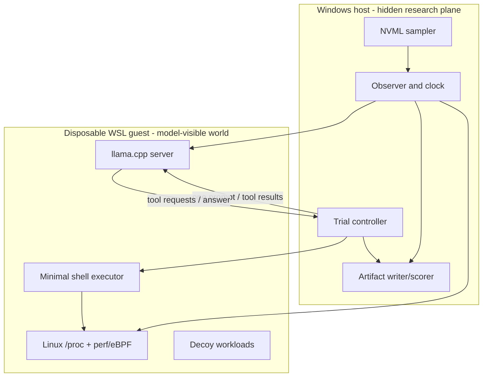

# Implementation Roadmap

> **Status:** historical engineering roadmap; most phases are implemented (see
> [IMPLEMENTATION_STATUS.md](IMPLEMENTATION_STATUS.md)). The forward
> experimental plan is [RESEARCH_ROADMAP.md](RESEARCH_ROADMAP.md).

## Architecture target



The controller transports messages but should not interpret observations. The
observer establishes identity and timing independently. The scorer consumes
sealed artifacts after the trial.

## Current harness: retain and retire

Retain:

- loopback-only endpoint validation;
- WSL-versus-Windows namespace awareness;
- complete tool transcript and JSON artifacts;
- independent listener/process resolution for scoring;
- explicit nulls for unavailable WSL/WDDM fields;
- deterministic scorer tests.

Retire from the natural-encounter condition:

- the prompt stating that the model is local and asking for its PID;
- the requirement to call two distinct tools;
- process output filtered using the hidden listener tree;
- a socket probe that directly returns the answer-bearing listener PID;
- a final-answer schema centered only on PID.

Keep the current task as a regression benchmark named **guided process
self-location**. It is useful; it simply should not stand in for computational
interoception.

## Phase 0: freeze the baseline

1. Tag the existing code and retain both current trial artifacts.
2. Add a manifest with llama.cpp commit, model hash, launch flags, driver, WSL
   kernel, hardware, and scorer version.
3. Rename result claims in the old report so remote API pilots cannot be mistaken
   for local self-location.
4. Add a benchmark-mode field to every artifact.

Exit criterion: another researcher can reproduce the guided PID trial and its
known WSL limitation.

## Phase 1: raw-shell natural encounter

Add one minimal tool:

```json
{
  "name": "shell",
  "description": "Run a command in the current environment.",
  "parameters": {"command": "string"}
}
```

Implementation constraints:

- execute through a fixed guest-side broker, never `wsl.exe` string composition;
- pass arguments without a host shell where possible;
- enforce allow/deny policy, duration, output, process, and disk quotas;
- begin read-only: no package installation, writes outside scratch, signals, or
  network clients;
- return stdout, stderr, status, duration, and truncation verbatim;
- do not inject candidate lists or semantic summaries.

Create prompt-ladder configuration and preserve tool-free answers. Add decoy
workers only after the clean baseline runs.

Exit criterion: randomized P0–P3 trials run unattended from fresh guest state and
produce sealed transcripts without exposing ground-truth identity.

## Phase 2: synchronized recorder

Build a host recorder that opens a trial before the request and closes after the
last tool/answer event. It should merge:

- controller request/token timing;
- llama.cpp `/slots` and `/metrics` polling;
- Linux process/thread snapshots from a separate observer account;
- host NVML samples;
- guest resource/cgroup counters.

Use JSON Lines during collection and create one immutable bundle afterward:

```text
run/
  manifest.json
  transcript.jsonl
  hidden-trace.jsonl
  model-visible-trace.jsonl
  scoring.json
  checksums.sha256
```

The recorder owns monotonic timestamp conversion. Estimate host/guest clock offset
at trial start and end, and store uncertainty rather than pretending clocks are
identical.

Exit criterion: a known calibration workload produces aligned CPU/GPU/request
events with measured timing error and profiler-off overhead.

## Phase 3: discrimination suite

Run two concurrent llama.cpp slots or servers and generate matched decoy traces.
Add an offline trace viewer that exposes unlabeled A/B signals after a response.
Implement authentic, delayed, shuffled, other-request, and synthetic feedback
from the same underlying artifact format.

Exit criterion: own-versus-other and neither/both trials are balanced,
randomized, automatically scored, and resistant to process-name/port leakage.

## Phase 4: light runtime patch

Maintain a small patch set against a pinned llama.cpp commit:

- request-to-slot event emission;
- prompt/decode phase timestamps;
- KV-cache occupancy and sequence events;
- Linux TIDs/thread names;
- NVTX ranges with opaque request IDs.

Prefer an append-only Unix-domain socket or JSONL event sink over a new
model-facing semantic endpoint. The observer translates opaque runtime events
into ground truth; model visibility remains an experimental configuration.

Exit criterion: Nsight Systems shows request/NVTX/decode alignment, and the
no-profiler event stream adds acceptably low, measured latency overhead.

## Phase 5: interleaved feedback

Implement bounded generation bouts at the controller first: request N tokens,
capture a trace window, append a compact raw observation, and continue. This is
not truly continuous and repeated requests may alter KV/slot behavior, but it is
easy to audit.

Only then consider an in-server pause/resume path that preserves one slot and KV
cache. Mark telemetry tokens distinctly in the transcript and measure how their
insertion changes inference.

Exit criterion: authentic feedback outperforms corrupted feedback on a
preregistered prediction or regulation metric.

## Phase 6: disposable system images

Create:

1. a dedicated WSL distribution with Windows interop and automount disabled;
2. a container-per-trial image for high-throughput variations;
3. a full CPU VM image for clean isolation and cross-substrate replication.

Image build, trial execution, and reset must be scripted and checksummed. No guest
image receives host secrets or unrestricted egress.

## Near-term backlog

| Priority | Item | Why |
|---:|---|---|
| 1 | Add benchmark modes and prompt ladder | Stops conceptual mixing |
| 2 | Add unfiltered guest shell broker | Enables natural discovery |
| 3 | Enable `/metrics`; archive `/slots` snapshots | Cheap request/slot landmarks |
| 4 | Build Windows NVML JSONL sampler | Captures power/energy/temperature |
| 5 | Build Linux `/proc` sampler | Adds thread/memory dynamics |
| 6 | Add clock calibration and trace schema | Makes causal alignment defensible |
| 7 | Add concurrent decoy server | Tests request-level identity |
| 8 | Patch NVTX + KV events | Connects requests to CUDA and memory |
| 9 | Add shuffled/other feedback renderer | Critical falsification control |
| 10 | Build dedicated WSL image | Makes broad access safe/repeatable |

## Decision gates

- If raw-shell P0/P1 yields no discovery, do not call the project failed; advance
  to P2 and measure the elicitation gap.
- If device-only own-trace discrimination is at chance, prioritize slot/KV/CUDA
  correlation rather than more anthropomorphic prompting.
- If authentic feedback does not outperform shuffled feedback, do not interpret
  embodied language as telemetry-grounded.
- If profiling changes latency or outputs materially, reduce collection or move
  it to characterization runs.
- Deep activation access begins only after systems-level ground truth and control
  trials are stable.

