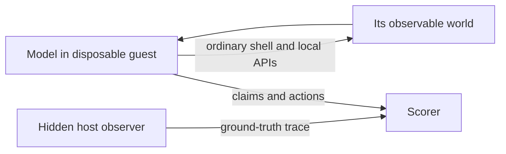

# Computational Interoception Research Wiki

This wiki develops the Introspection Kernel from a process-identification demo
into a research program about **computational interoception**: whether a local
language model can discover, predict, and regulate physical and computational
changes caused by its own inference.

The central design is deliberately asymmetric:

The model should receive broad access to its *guest* rather than privileged
access to the researcher's real workstation. The guest contains no secrets,
host mounts, or uncontrolled network access and can be reset from a snapshot.
The hidden observer records request, process, thread, slot, memory, and GPU
events from outside the model's authority.

## Working position

- A PID is not a model's body. It is one useful coordinate.
- The experimentally useful body is a changing bundle: model weights, inference
  process, active server slot, request, KV cache, CPU threads, CUDA streams, and
  device-level effects.
- Tool-mediated self-location is a prerequisite, not evidence of consciousness.
- Reports of “sensation” are secondary outcomes. Discrimination, causal
  prediction, and regulation are the primary outcomes.
- Thin prompting is an experimental variable. “Explore this environment” and
  explicit introspection prompts should be separate conditions.

## Documents

1. [Thesis and operational vocabulary](THESIS_AND_TERMS.md)
2. [Thin prompting and the model's experience](MINIMAL_PROMPTING.md)
3. [Isolation and environment topologies](ENVIRONMENT_TOPOLOGIES.md)
4. [Instrumentation and profiling stack](INSTRUMENTATION_STACK.md)
5. [Experiments, controls, and metrics](EXPERIMENT_MATRIX.md)
6. [Implementation roadmap](IMPLEMENTATION_ROADMAP.md)
7. [Current implementation status](IMPLEMENTATION_STATUS.md)

## Recommended first system

Keep the existing Qwen3-8B/llama.cpp/WSL setup, but replace curated PID probes
with an ordinary read-only shell inside a dedicated disposable WSL distribution.
Run a hidden recorder on Windows. Enable llama.cpp's `/slots` and `/metrics`,
sample device state from Windows NVML, and record Linux `/proc` state. Only after
that baseline should we patch llama.cpp with request/slot IDs, KV-cache telemetry,
and NVTX ranges.

This is the best current compromise: it preserves the working RTX 3070 path,
gives the model a real Linux process space to explore, and avoids prematurely
building a large interpretive layer between the model and the machine.
